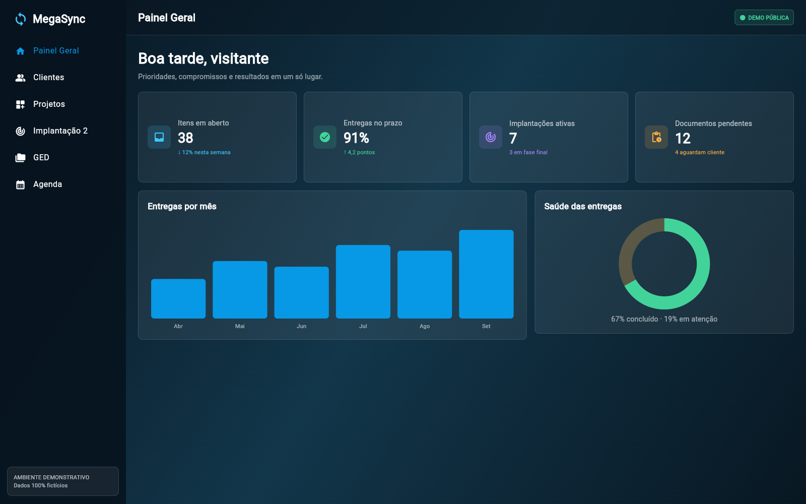
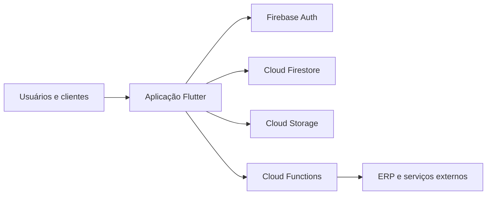

# MegaSync EMP — Demonstração

Uma demonstração pública e interativa do **MegaSync EMP**, plataforma de gestão empresarial criada para centralizar operação, projetos, documentos, clientes e implantações.

## Acessar

**[Abrir a demonstração online](https://megasyncpitch-demo.web.app/)**

> A demo é um build Flutter criado a partir do projeto MegaSync. Usa somente dados fictícios, não exige login e não inicializa Firebase, portanto não lê nem altera o ambiente de produção.

## Visão geral

O MegaSync organiza diferentes frentes de trabalho:

- **Painel Geral:** prioridades, prazos e indicadores operacionais;
- **CRM:** clientes, oportunidades e histórico;
- **Projetos:** quadros Kanban colaborativos;
- **Implantações:** ondas, etapas, subetapas e atividades;
- **GED:** documentos, assinatura, validação e comunicação;
- **Agenda:** compromissos consolidados dos demais módulos.

## Destaques

- Arquitetura multiempresa e permissões granulares;
- Atualizações em tempo real e interface responsiva;
- Integração entre operação, agenda, notificações e indicadores;
- Portais externos com acesso controlado;
- Integração ERP por API.

## Arquitetura

## Sobre este repositório

Este é um **repositório de apresentação**. O código-fonte proprietário do produto e o código de publicação da demo não fazem parte do repositório público. Aqui ficam apenas documentação e imagens autorizadas para portfólio.

O build demonstrativo é mantido no repositório privado principal do produto e publicado separadamente no Firebase Hosting.

Desenvolvido por [Shiau Lon](https://github.com/shiaulon).
