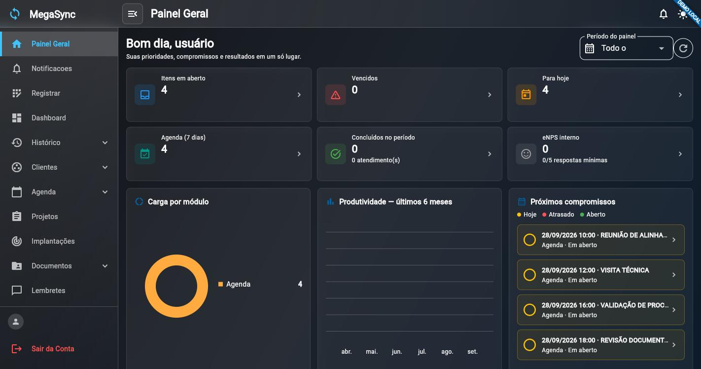
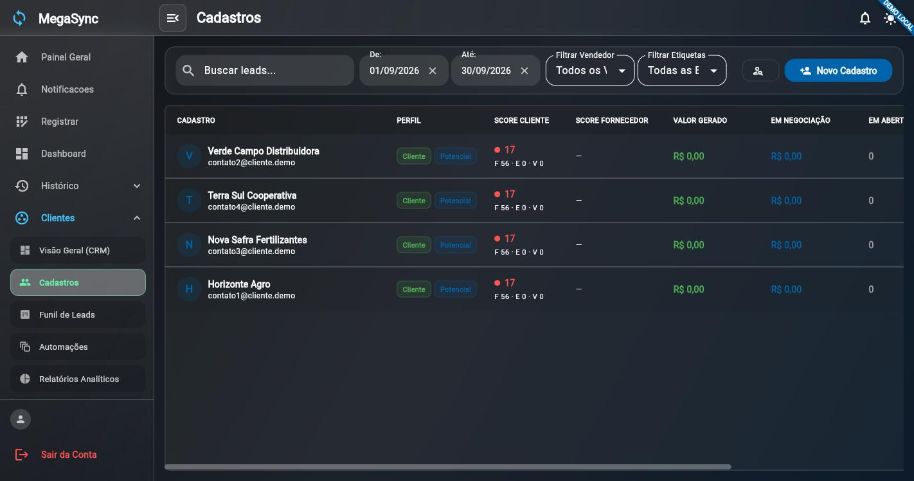
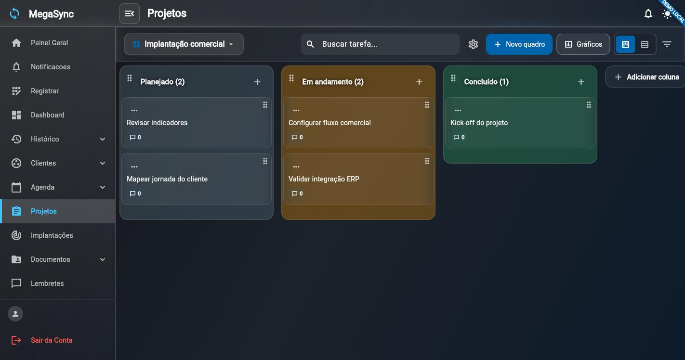
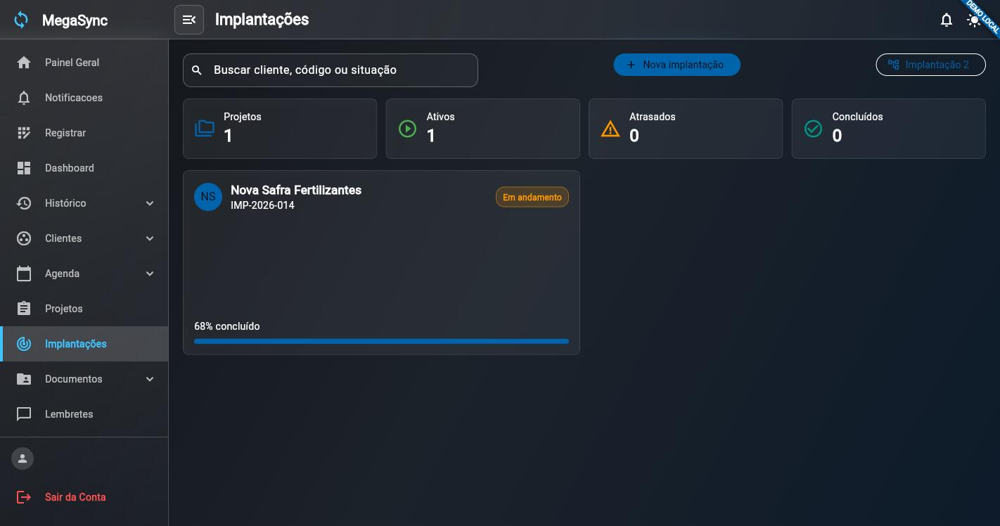
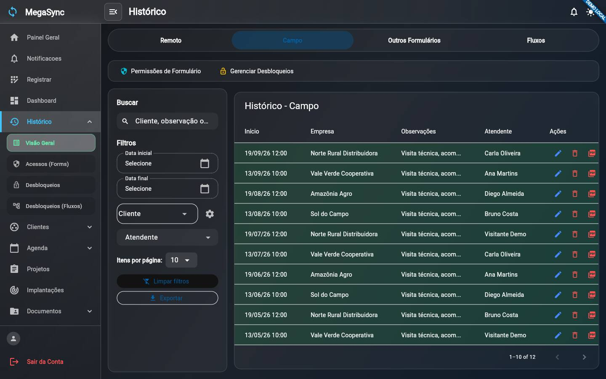
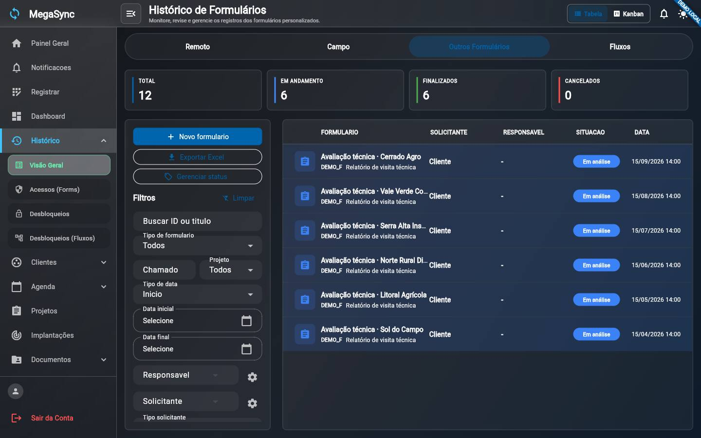
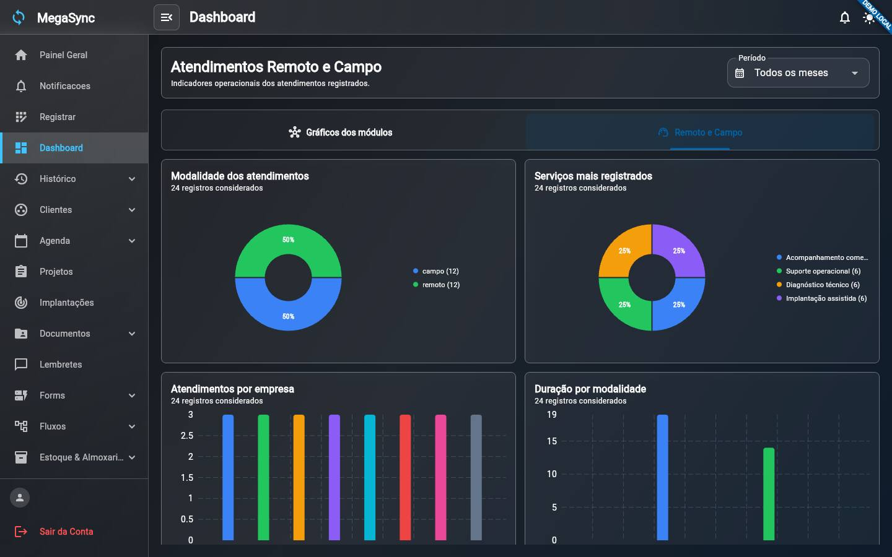
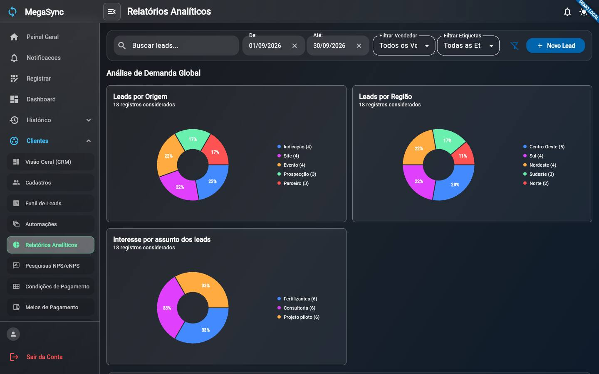
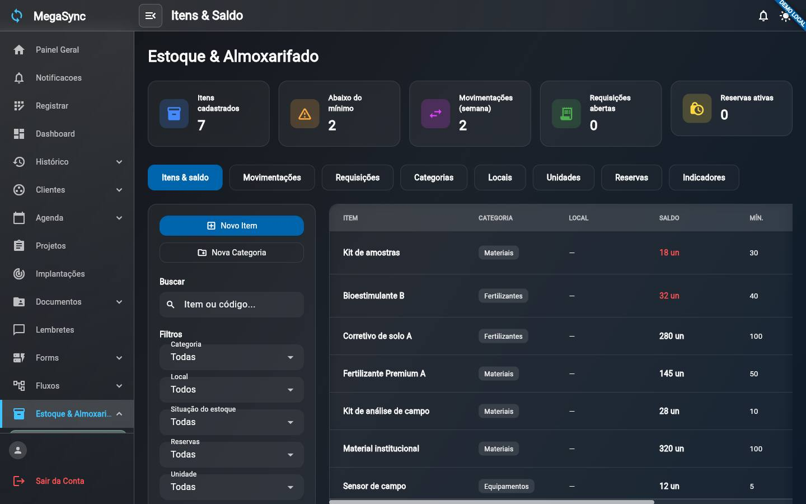
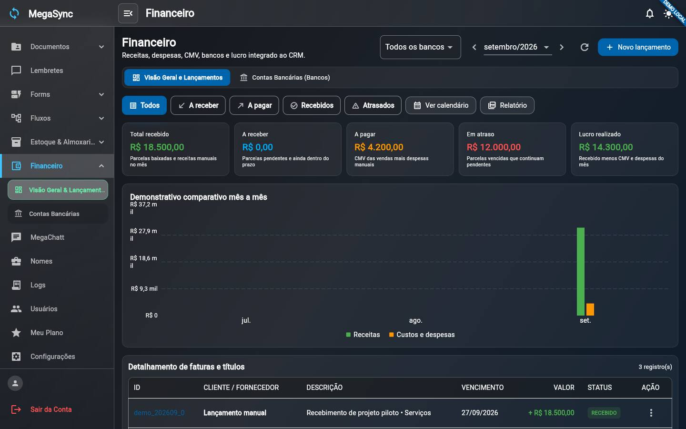

# MegaSync EMP

### Uma plataforma para acompanhar a operação de ponta a ponta

O MegaSync EMP reúne relacionamento com clientes, projetos, documentos, agenda e implantações em um único ambiente. Este repositório apresenta uma demonstração pública do produto, construída com dados fictícios para mostrar a experiência de uso sem expor informações de empresas reais.

[**Abrir demonstração interativa**](https://megasyncpitch-demo.web.app/) · [**Ver capturas de tela**](#capturas-de-tela)

## O que você pode explorar

| Área | Exemplo disponível na demo |
| --- | --- |
| Painel Geral | Prioridades, compromissos e indicadores operacionais |
| Dashboard | Indicadores de atendimentos Remoto e Campo, já selecionados na abertura |
| Clientes | Cadastros fictícios e relacionamento comercial |
| Relatórios Analíticos | Leads por origem, região, assunto e resultado comercial |
| Projetos | Quadro com cartões em diferentes etapas |
| Agenda | Reuniões, visitas e validações planejadas |
| GED | Documentos de exemplo e seus estados de acompanhamento |
| Implantações | Projeto fictício organizado em ondas e atividades |
| Histórico | Atendimentos, formulários e execuções de fluxos |
| Estoque | Itens, saldos mínimos e movimentações ilustrativas |
| Financeiro | Receitas, despesas e vendas sintéticas do CRM |

Para um passeio rápido, abra o Painel Geral, entre em Clientes para conhecer os cadastros e depois navegue até Projetos e Implantações. É possível experimentar alterações nos recursos que funcionam offline; elas ficam apenas no navegador usado na visita.

## Capturas de tela

As imagens abaixo são da demonstração com dados sintéticos. Clique para ver em tamanho maior.

| Painel Geral | Clientes |
| --- | --- |
|  |  |

| Projetos | Implantação |
| --- | --- |
|  |  |

| Histórico de Campo | Formulários |
| --- | --- |
|  |  |

| Dashboard Remoto e Campo | Relatório Analítico de Clientes |
| --- | --- |
|  |  |

| Estoque | Financeiro |
| --- | --- |
|  |  |

## O problema que o produto resolve

Quando clientes, tarefas, documentos e prazos vivem em ferramentas separadas, o histórico se fragmenta e o acompanhamento depende de planilhas ou mensagens avulsas. O MegaSync conecta esses objetos: um cliente pode ter oportunidades, tarefas, documentos e uma implantação relacionados; os responsáveis acompanham o trabalho pelas telas operacionais e pelos indicadores.

O produto completo inclui controle de acesso por organização e cargo, fluxos de aprovação, notificações, portais externos, anexos e integração ERP. Parte desses recursos depende de serviços de backend e, por segurança, não está habilitada nesta demo pública.

## Decisões técnicas da demonstração

- A interface é uma cópia do aplicativo Flutter Web, publicada em um projeto Firebase separado do ambiente de produção.
- O visitante entra anonimamente, sem criar uma conta pessoal.
- A cada novo mês, a demo prepara novamente clientes, leads, atendimentos e demais exemplos dos seis meses anteriores. Assim, o visitante encontra histórico e indicadores preenchidos independentemente do mês em que acessar.
- O Firestore da demo trabalha com a rede desativada; alterações feitas durante a visita permanecem no armazenamento local do navegador, sem gravar dados de negócio no banco remoto.
- Regras do projeto de demonstração negam leitura e escrita remotas no Firestore como segunda barreira.
- Em navegação privada, o navegador pode apagar as alterações locais ao encerrar a sessão.

A demo é um ambiente de exploração visual e operacional, não um serviço para armazenar informações reais. Não insira dados pessoais ou confidenciais. Recursos que exigem envio de arquivo, links externos, sincronização entre pessoas, ERP ou Cloud Functions podem estar indisponíveis.

## Arquitetura do produto

O aplicativo principal usa Flutter/Dart no frontend e Firebase Authentication, Cloud Firestore, Cloud Storage e Cloud Functions no backend. A organização ativa delimita os dados e as regras de acesso são aplicadas também no servidor, não apenas nos menus. Módulos compartilham vínculos e eventos para que uma ação operacional apareça no contexto certo.

Esta demo mantém a mesma interface em um projeto Firebase isolado, mas troca a persistência remota por uma base local fictícia. Assim é possível apresentar o produto sem abrir acesso ao banco de produção nem permitir que visitantes alterem dados compartilhados.

## Meu trabalho

Desenvolvimento da aplicação, arquitetura multiempresa, interfaces operacionais, integrações entre módulos, regras de segurança e experiência demonstrativa. O foco do projeto é transformar processos de trabalho complexos em telas úteis para a operação diária.

## Sobre o código

Este é um repositório de portfólio: documentação e imagens autorizadas, sem o código-fonte proprietário nem credenciais. O aplicativo compilado é servido separadamente pelo Firebase Hosting. Como em qualquer aplicação Web, os arquivos necessários para executar a interface são entregues ao navegador; a ausência do código-fonte no Git não representa proteção absoluta contra engenharia reversa.

MegaSync EMP é um produto proprietário. Todos os nomes e registros visíveis nesta demonstração são fictícios.

Desenvolvido por [Shiau Lon](https://github.com/shiaulon).
